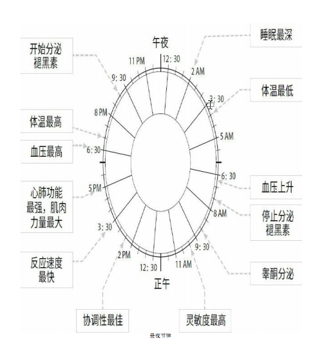
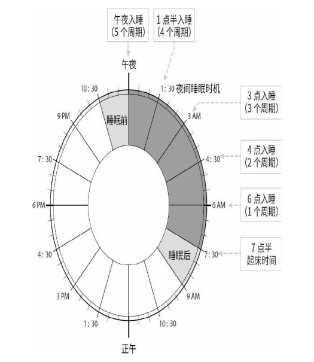
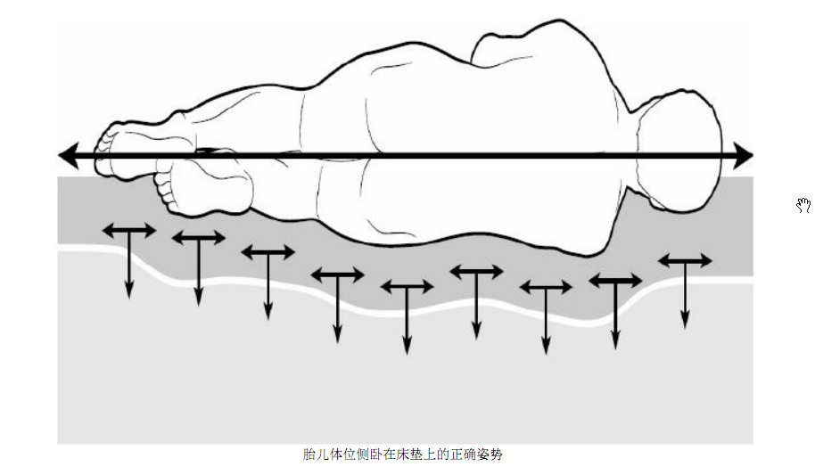

# 睡眠修复的关键指标  
## 01 时钟在滴答--昼夜节律  
### 你知道昼夜节律吗？  
> 昼夜节律是**生命体24小时的内循环**，受我们的**内置生物钟**的管理。我们大脑中的这一生物钟，24小时调节着我们的多个内部系统，包括睡眠和饮食习惯、激素的分泌、体温、灵敏度、情绪和消化，使其与地球自转相一致。我们的生物钟是根据一些外部线索而设定的，其中主要包括日光，此外还有温度、进食时间等其他因素。  

### 光线对睡眠的影响  
- 光线是最重要的生物钟调节器，没有什么比早晨的阳光更加美好。所以单你醒来时请拉开窗帘，吃个早饭，沐浴一下阳光，然后再出门。  

- 人体对一种蓝光特别敏感。蓝光并不全是有害光，只有不合时宜的蓝光才对人体有害。  
  - 白天的蓝光对人体是有益的。它能帮助设置人体的生物钟、抑制褪黑素的分泌，提高人的灵敏度和各方面表现。  

  - 但天黑以后，蓝光就成了一种不良光了。如果入夜了还使用电子产品或者夜深人静时还对着一片蓝光，就会引发各种健康问题。它会妨碍褪黑素的分泌并推迟我们的生物钟。

### 符合昼夜节律的小建议  
- 如果健身计划中包含晚上去健身房做剧烈运动，可需要注意了，这个时间是一天中血压最高的时候，而剧烈运动会引起血压飙升；因此，不妨套上可穿戴设备，看看情况如何，想想要不要换个更好的时间健身。  

- 如果深夜还处理了和电子产品相关的工作，不要马上睡觉，关上灯，先坐一会儿，让松果腺高效地工作并在黑暗环境中有效分泌褪黑素，而这正是生物钟想做的事。  

### 昼夜节律：智慧睡眠的7个要点  
1. 走到户外！让日光调整你的生物钟，而不是人工光线。（尤其是早上）  

2. 花一点时间了解下自己的昼夜节律，以及它将如何影响你的生活。  
3. 了解你的各项高峰和低谷数值，监控那些会在你身上自然而然发生的变化。  
4. 睡眠质量最高的时间出现在凌晨2-3点，如果日出了再睡就违背了生物钟。  
5. **早上放慢速度**。睡眠质量和我们早上醒来之后的所做所为息息相关。  
6. 在晚上，蓝光是一种不合时宜的光线，尽量让蓝光变得暗淡。  
7. 想象自己此刻在一个岛屿上、坐在篝火边的场景：在你目前在做的事情中，哪些和这一场景起了冲突？你打算如何纠正过来？对目前的日常安排做出一些简单的改变，使你自己的身体状态更加吻合人体昼夜节律。

## 02 走慢与走快--睡眠类型  
### 你知道自己的睡眠类型吗？  
- 晚睡星人：  
> 熬夜、晚睡、早晨起床需要闹钟、白天午睡、常常不吃早餐、不上班喜欢多睡。  

- 早起星人：（小孩）  
> 早睡、自然醒、美美的享用他们的早餐、白天不会感到疲倦。  

- 介于中间型：  
> 晚上睡的较晚、早上也需要闹钟叫醒。  

### 咖啡因的利弊  
- 小量摄入咖啡因有助于提高灵敏度、反应速度、注意力和耐久的功效。  

- 大量摄入咖啡因会令人焦虑不安。如果血液中的咖啡因浓度过高，将导致入睡困难或睡不安稳。  
- 咖啡因是一种容易让人上瘾的药物，如果每天摄入量都大于400毫克（辛巴克一大杯现磨咖啡含有330毫克咖啡因 ），就会对它产生耐受力。你会需要越来越多的咖啡因才能达到想要的效果。  
- 咖啡因的半衰期是6小时。因此尽量避免晚上喝。  
- 最好在最需要集中注意力的时候再使用。  

### 掌控你的睡眠类型  
- 晚睡星人如果想调整自己的生物钟，让自己跟上早起人的节奏，那么早晨的阳光极为重要。可以去买一台模拟日出自然唤醒灯（小米有很多款），或者拉开窗帘，走到户外。  

- 周末不能睡懒觉。不然生物钟又会被调回到它原来的样子，周一就又得重新开始新一轮煎熬了。  

- 如果伴侣一个是早睡型一个是晚睡型就中和下，早上早睡型准备早餐让晚睡型在日光下自然醒。晚上晚睡型准备晚餐。    

### 睡眠类型：智慧睡眠的7个要点  
1. 了解自己和自己的亲朋好友属于哪种睡眠类型。  

2. 巧妙的规划好一天的日程，在自己状态最佳的做最重要的事。  
3. 把咖啡因当成高效的表现增强剂使用，而不是出于习惯去喝，并且一天的咖啡因摄入量不要超过400毫克。  
4. 晚睡星人如果想要克服社交时差，就不要在周末睡懒觉。  
5. 在会议室、办公室和办公桌配置日光灯，提高员工的灵敏度、工作效率，并改善他们的工作情绪。  
6. 知道何时该上前、何时该后退。（要考虑到自己的睡眠类型再做决定）  
7. 如果和伴侣属于不同睡眠类型，应该学会彼此协调、彼此适用。

## 03 90分钟睡眠法--睡眠周期  
8小时其实是每晚的人均睡眠时间，一味的追求8小时睡眠而产生的巨大压力，反而对我们的睡眠起着破坏性极强的反作用，让我们无法获取得到真正需要的、因人而异的睡眠时间。  

### 睡眠周期  
“R90”指的是以90分钟为一个周期，获得身体修复。从临床上说，90分钟是一个人经历各个睡眠阶段所需要的时间。这些睡眠阶段组成了一个睡眠周期。  

我们的睡眠周期由4个（有时候是5个）不同睡眠阶段组成：  
- 第一阶段：非眼动睡眠（打瞌睡）  
  似睡非睡、朦朦胧胧。很容易被惊醒。（开门、大声说话...）  

- 第二阶段：非眼动睡眠（浅睡眠）  
  心率和体温出现下降。如果有人大声喊你的名字你还是会醒来。这一阶段的睡眠时间占比最高。  

- 第三、四阶段：眼动睡眠（深睡眠）    
  很难被吵醒。梦游症患者会在这个阶段开始梦游。我们希望能在这个阶段多做停留、沉浸其中，因为睡眠的生理修复功效大多产生于这一阶段，比如生长激素分泌量的增加。  

- 第五阶段：快速眼动睡眠（做梦）  
  我们所做的绝大多数梦都在这一阶段发生。这一阶段也被认为有益于开发创造力。这个阶段结束时，我们会醒来，但通常情况下，我们不会记得自己曾经醒来然后就进入下一个睡眠周期。  

试图通过早点睡觉或晚点起床来补觉，其实是在浪费时间。失去的睡眠，无法再补回来，但我们的身体非常善于对此进行补救。  

如果想提高睡眠修复的质量，那么设置固定时间的闹钟，正是我们能采取的最有效的方法。  

理想状态下，固定起床时间应该比你必须上班、上学或做其他事情的时间早90min；这样在睡醒之后，你才有充分的准备时间。  

如果一周能得到35个睡眠周期（每天7.5h），就非常完美。但现实生活会以各种方式干预我们的睡眠，因此如果有固定起床点，就从固定点算起，按周期分配睡眠时间：  

每个人需要的睡眠时间都不一样，我们可以先从每晚5个睡眠周期开始， 看看7天之后效果如何。如果觉得太多可以减少到4个周期。反之，如果没有睡好，可以增加到6个周期。直到找到最适合自己的睡眠时间。  

### 睡眠周期：智慧睡眠的7个要点  
1. 固定的起床时间就像一根铁锚，支撑着整个R90方案。设定一个固定的起床时间，并持之以恒的坚持下去。  

2. 用90分钟时长的睡眠周期衡量睡眠，而不是睡了多少时间。  
3. 你可以自行选择入睡时间，但入睡时间取决于你起床的时间。从起床时间出发，根据90分钟时长的睡眠周期，向后推算。同时需要考虑到你需要多长时间才能入睡，适当的提前一点准备。  
4. 把睡眠放在更长一段时间中考虑，减少不必要的压力。一个“没睡好的糟糕晚上”不会要了你的命，不妨试着考虑，你每周一共获得了多少睡眠周期。  
5. 尽量避免连续三个晚上睡眠不足（少于理想的睡眠周期）的情况发生。  
6. 睡眠不是一个简单的数量或质量问题，试试了解你究极需要多少睡眠时间。对大多数人而言，每周35个睡眠周期是最理想的。28-30个睡眠周期也比较理想。  
7. 争取每周至少有4个晚上能获得理想的睡眠周期。 

## 04 热身与舒缓--睡眠前后的例行程序  
睡前的行为会直接影响睡眠质量和持续时间，而醒后的行为会对新的一天（以及第二天晚上）产生重大影响。这两段时间和实际睡着的时间段同等重要。理想状态下，睡前和醒后都需要一个睡眠周期进行缓冲。  

### 睡觉前  
-  尽量减少电子产品的使用   
  尤其是大屏设备 手机最好调成夜光模式  备注每天查看电子邮件的时间尽量不要睡前回复消息 （阅读  助眠软件）  

- 确保被子既不能太暖，也不能太冷。  
- 让卧室保持凉爽（不是寒冷）非常关键。  

  在冬季，可以在睡前关掉卧室的取暖器或空调，冲一个温水澡（不是热水澡），让体温升高一两摄氏度，这样当你开始睡眠时，就能更好地适应从白天到夜间的温度变化。   

  在夏季，白天拉上窗帘并保持房间通风，能让卧室比家里其它地方低那么一两摄氏度。特别炎热的日子，睡前一段时间给房间降降温。    

- 在进入睡眠准备阶段时，让一切暗淡下来是一个不错的主意。关掉卧室的主灯源，打开暖色灯具。卫生间最好也换成暖光灯。  
- 如果想睡前看一会书，可以考虑在卧室外面看书，这样就能实现从明亮环境到昏暗卧室环境的完美转移。   
- 睡前是整理物品的好时机，当然只是对环境略加整理；不必弄什么大动作。也可以准备一下明天的生活必需品（熨烫衣服 处理垃圾 洗碗...）。
- 通过“下载”我们的一天，帮助大脑处理这一天所经历的事。可以把一天中的各种经历分门别类进行归档，便于大脑在睡眠是消化它们。可以尝试拿出纸笔，列一份“我在想什么”清单，把当天所有想法、担心和关心的一切都写下来。放在一个第二天不会落下的东西旁边。  
- 睡眠是一天最容易受到攻击的时机，因此我们需要足够的安全保证。关上所有门窗或者再检查一下是否都关好了，能增强我们的安全感。  
- 睡前定量的轻微运动（瑜伽 散步 伸展运动...）有助于睡眠。  
- 用鼻呼吸的睡眠

### 醒来后
- 不要在刚刚睡醒的时候就匆匆查看手机上的通知和消息，此刻的状态欠佳，无法妥善地处理问题，至少醒来15min之后再进行处理。（可以设个闹钟）    

- 吃一个丰盛的早餐。（带来一天的能量  补充水分  最好在户外或在日光灯下）
- 锻炼也是一项极佳的睡眠后例行程序。（晨跑 散步 瑜伽 步行或骑自行车上班 最好去户外）  
- 适度的脑力挑战（广播  熨烫衣服  看看新闻...）  
- 晚睡星人用在睡眠后例行程序上的时间越接近90min对他们越有利。（可以在办公桌上放一盏日光灯。）  

### 睡眠前后的例行程序：智慧睡眠的7个要点 
1. 睡眠前后的例行程序将直接影响你的睡眠质量，以及你清醒的一天：如果予以重视，整个白天和晚上就会更加高效。  

2. 在日间偶尔脱离电子设备，将此作为一种犒劳，并通过这种方式训练你的身体和心灵。  
3. 对于晚睡星人来说，睡眠后例行程序至关重要。  
4. 不要在头脑不清醒的时候发送消息！先让自己清醒点再去拿手机。  
5. 让你的身体感受从温暖到凉爽的变化，有利于带来自然的体温下降。快速洗个温水浴，然后选择较为凉爽的睡眠环境，能帮助你达到目的。  
6. 在上床前整理你的卧室，放空你的大脑，“下载” 你的一天，就不会在该睡觉的时候想东想西、难以入眠。  
7. 执行睡前例行程序，是为了结束过去的一天--用鼻子呼吸、发送心情、实现从明亮到昏暗的过渡。  
执行睡后例行程序，是为了开启不匆不忙的一天。这两段时间都只属于你，不属于别人。

## 05 暂停片刻，该休息了！--日间小睡   
### 日间小睡 
防止“可控修复期”（日间小睡30min或一个睡眠周期  可加入到一周总睡眠时间中）后的睡眠惰性：  

- 睡前喝一杯咖啡。（一般20分钟后就会作用于人体）注意用量，如果已经超过了400毫克就不能再喝了。  

- 在办公桌上放一盏日光灯，或者走到阳光下。    

- 如果在家，千万不要上床午睡，并将手机调成免打扰模式。  

- 如果睡不着可以尝试“下载”当前的内容。  

- 小睡醒来后，花5min时间，让自己熟悉下周围的环境，补充点水分。如果有可能的话，沐浴下日光。  

### 傍晚修复期
下班路上打盹、回家坐沙发上打盹等等。如果我们错过了日间小睡的机会，可以在傍晚5-7 | 6-8点小憩30min。但不宜过久，否则会影响晚上的睡眠周期。

### 休息片刻  
从长远的角度上来看，这些日间小睡并不能代替夜间的睡眠周期。每周你至少确保有4个晚上能获得理想的睡眠周期。但这些日间小睡能促进身心的全面修复，并让你保持良好的精神状态和较高的工作效率。  

如果做不到每隔1h至少保证每隔90min（设个闹钟）找个理由（上厕所、打水[每次只打一小点]）离开办公桌一会儿。   

如果开会的时候和自己不大相关，可以睁着眼睛“下载”一天的内容，或者发呆来获得高效休息。

### 日间小睡：智慧睡眠的7个要点  
1. 利用午后休憩时机（下午1-3点）给自己安排一个可控修复期，（30min）是弥补夜间睡眠周期的完美方法，这也与你的昼夜节律彼此协调。  

2. 黄昏（下午5-7|6-8点）是次优的休憩时机，因为此时人的睡眠需求极高。但这一时段的日间小睡应控制在30min之内，这样才不会影响晚上的睡眠。  

3. 白天睡不着？没关系。只要花30min放松一会儿，暂时脱离周围的世界片刻。  

4. 至少每隔90min休息一会儿，消除大脑的疲劳，提高注意力的集中水平。在休息时不要使用电子设备。  

5. 不要受到你所在的企业文化影响，应着手构建一种接受日间小睡和休憩的企业文化--“你若不打盹，就会输的很惨”；  

6. 使用冥想或正念软件，或者把玩某个珍爱的私人物品，暂时脱离当前环境。  

7. 如果真的无法脱身，就巧妙地安排一天的工作。（困得时候做一些简单的）在午后倦怠期，不要让自己困于太费神的工作。

## 06 改造你的床铺--寝具套装    
### 正确的睡姿  
- 仰卧    
  - 能让肩背保持直线型。（前提肩没靠在枕头上）    

  - 它会让我们的喉部肌肉过于放松，有可能导致呼吸道阻塞。  
  - 相对于侧卧位的人，仰卧更容易打鼾或出现睡眠呼吸暂停。  
  - 会让我们产生被暴露的感觉，导致大脑不得不提高警觉。  

- 俯卧  
  - 能改善打鼾，但趴着睡容易伤脊椎。    

  - 会引起腰背部疼痛、颈部疼痛和多种疾患。   

- 侧卧  
  - 最推荐的一种方式，建议采用胎儿的姿势、躺向相对不太重要的身体一侧。（右侧）    

  - 胎儿睡姿要点：  
    1.膝盖自然弯曲、两条手臂放在身前，并轻轻的交叠在一起。  
    2.颈部、脊柱和臀部形成一条平滑的直线。  
  夜间时采用这种睡姿时间越长越好。

### 床垫选择  
1. 移走床垫上的所有东西  

2. 采用胎儿的姿势躺在床垫上   

3. 当你的头部、颈部和脊柱形成一条直线时，如果脑袋和床垫之间的那个空隙非常明显，让脑袋下意识的想要歪向床垫，说明这个床垫太硬了。  

4. 如果你的臀部陷入了床垫中，而脑袋被床垫垫高了，说明床垫太软了。  

5. 软硬适中的床垫，应该轻松地接受你的体型和体重、均衡地承受你的体重，让你形成直线型的睡姿，如下图所示：  

   

### 枕头选择  
- 枕头的功效只有一个：补偿床垫的不足。（尤其是较硬的床垫）  

- 如果选对了床垫，那么枕头完全是多余的。一个薄薄的枕头就足够了。

### 寝具套餐  
- 寝具应该需要更频繁的更换而不是过个10年20年再换一次。  

- 床垫随着时间推移而日渐损坏，还会不断积攒细菌、尘螨等有害物质。  

- 可以在床垫上再铺上一层额外的床垫，并加上一个可拆卸、可清洗的床垫套。   

- 如果床垫有几层，那每隔几年更换其中某一层或几层。  

- 你所有的床上用品都应该选择低过敏性材质的。  

- 尘螨生在地毯、衣服和床上用品中。它们喜欢潮湿的地方，以人脱落的皮屑为食。它们的排泄物会引起人体过敏反应。所以务必保持床上及相关用品的整洁。  

- 你的床上用品应该是透气的。  

- 被单和枕套都是白色的，白色显得干净、中性。羽绒被非常轻薄，可以机洗，因此更加方便，最好选用纳米技术制造的。  

- 床上用品保持清洁，实际上对人体大有裨益，最好选用速干的，这样可以保证至少一周清洗一次没有问题。  

### 寝具套装：智慧睡眠的7个要点  
1. 学会以胎儿姿势睡眠，躺向非主要的身体一侧（惯用左手的人向右侧睡，惯用右手的人向左侧睡）。  

2. 检测床垫，了解什么样的床垫对你来说软硬适中。（头部、颈部和脊柱形成一条直线）  

3. 循序渐进：宁可多买几次床垫，也不要一次花大价钱买一个床垫用很多年。可以考虑买能够经常换洗的床垫。  

4. 使用低过敏性、透气舒适的床上用品（纳米材料），无论你是否属于过敏体质。避免潜在的睡眠障碍因素，并注意调节好温度。  

5. 床的尺寸很重要--能买多大就买多大。（双人床是给一个人睡的）

6. 不要盲目购置寝具！可以根据销售人员的介绍，了解你能买到什么样的寝具。  

7. 记住床垫可床架重要性比率：你可以把100%的预算全花在购置床垫上，因为床架主要是装饰的。

## 07 修复室--睡眠环境   
### 挪走杂物  
- 卧室把墙壁涂成白色，不要挂任何东西，尽可能的保持房间的空旷。   

- 保证晚上的时候完全漆黑，不漏光。早上起来的时候应立即打开窗户。  

- 让卧室保持在16-18摄氏度是最理想的，最符合自然进程。但每个人对温度的敏感度都不同，可以找到最适应自己的温度。无论气温如何，由温暖向凉爽的过渡是舒适睡眠的关键。  

- 如果有条件，把衣服、衣橱和别的橱柜--这些对睡眠没用的东西都放在别处。  

- 如果可以选择的话，最好别在卧室中学习。  

- 你的卧室需要的是一个闹钟(确保不会发出噪音)，当然一台模拟日出自然唤醒灯更加理想，而不是你的手机。   

- 确保睡觉前所有的电子设备都已关闭。  

- 如果你属于敏感体质，那么可以购置一台无声无光的高效空气净化器，它能帮助你在每晚安然入睡。  

- 尽可能的保证卧室的整洁，床上用品需要定时清洗。（至少一星期一次）  

- 尽量营造一个没有噪音干扰的卧室，如果没条件，可以试试晚上听点白噪音入睡。  

- 如果能营造出较好的安全感也能有助于睡眠。  
  - 睡前检查是否锁好了门窗。   

  - 在床边放一张爱人的照片，或者最喜欢的物件(泰迪熊、洋娃娃...)。  

  - 无论这个物品是什么，它都应该能给你带来足够的安全感，这样你的大脑才会放松警惕，安然进入睡眠周期。   

### 睡眠环境：智慧睡眠的7个要点  
1. 你的卧室不应该成为你生活空间的延展。如果可以的话，把它重命名为你的身心修复室。  

2. 清空你的房间（哪怕只在你的脑海中），只把睡眠、修复、休息所必须的东西拿回房间（寝具、空气净化器、闹钟或自然唤醒灯）。  

3. 让你的房间隔离外界光源，这样室外的光线就不会干扰你的睡眠。  

4. 让你的房间比家中其它地方更加凉爽(16-18 找到最合适自己的温度)，但不是更寒冷。   

5. 你的房间能给你带来安全感。（放上你最喜欢的物件或再次检查门窗是否锁好）  

6. 让房间的装饰风格保持中性（白色 不要挂任何东西），保持房间洁净，避免任何可能刺激大脑的东西。  

7. 控制房间中电子设备的使用，在夜间关闭待机灯。把手机拿出房间，或者至少放在你看不见的地方（并设置成静音）。  

# R90在行动  
## 01 把握先机--利用R90修复方案    
- 固定起床时间，不论因为什么原因让你没能获得理想的睡眠周期，但一定要按时起来，推迟起床时间、过早上床休息都无事于补。  

- 可以把目光放长远点，不要只关注一天的时光，而是展望更长一段时期，把一天的安排当成一周日程的组成部分。如果某一天没睡好，可以通过可控修复期补一下，但确保每周至少有4天能获得理想睡眠周期。  

- 健康的生活方式包括充沛而均衡的营养、充足的体育锻炼和睡眠修复。  

- 争取在睡前3h前进食晚餐，并将最后一次吃零食的时间控制在睡前90min之前，也就是刚开始执行睡眠前例行程序的时候。  

- 起床后一定要吃早晨，吃早餐能帮助你养成定时起床的习惯。   

- 每周进行150min的中强度锻炼(可以让大脑获得休息的时间)，能让睡眠质量提高65%。

- 睡觉前最好不要做剧烈运动。 、

## 02 与敌同眠--各种睡眠问题  
- 失眠是过度清醒造成的。在过度清醒状态下，人脑会因过于兴奋而难以入眠。  

- 使用安眠药不当，会带来巨大的危险。和未服用安眠药的人相比，服用安眠药的人猝死的几率显著上升。它会让人上瘾，会让人养成在睡前吃安眠药的习惯，它更像是安慰剂，但也只是暂时有效。  

- 如果睡不着，试着用别的方式休息一下。比如试着冥想，或者重温一下那些开心的事。   

- 如果出现时差反应，那可以提前飞往目的地先适用当地时差，回来后再修整一两天，回归正常的生活。  

## 03 主队--性、伴侣和现代家庭  

# 个人最佳状态